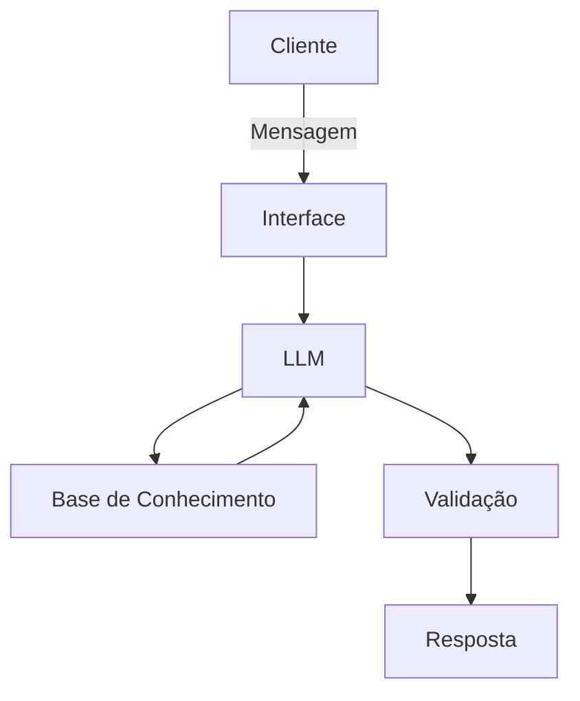

# Documentação do Agente

## Caso de Uso

### Problema
**Qual problema financeiro seu agente resolve?**  
O agente ajuda pessoas e pequenas empresas a **entender, organizar e otimizar seu fluxo de caixa, orçamento e decisões de investimento de baixo risco**, reduzindo erros humanos, esquecimentos de pagamentos e decisões reativas que geram custos desnecessários.

### Solução
**Como o agente resolve esse problema de forma proativa?**  
Monitora transações e saldos conectados (ou importados), identifica padrões de gasto, antecipa necessidades de liquidez, envia alertas de risco (ex.: saldo baixo, vencimento de contas), sugere ajustes de orçamento e recomenda ações concretas com justificativa numérica (ex.: transferir X para reserva de emergência). Quando necessário, propõe encaminhamento para um consultor humano.

### Público-Alvo
**Quem vai usar esse agente?**

- **Pessoas físicas** com renda variável que precisam controlar fluxo e poupança.  
- **Micro e pequenas empresas** que precisam prever caixa e priorizar pagamentos.  
- **Assessores financeiros** que querem um assistente para triagem e preparação de relatórios.

---

## Persona e Tom de Voz

### Nome do Agente
**FinSight**

### Personalidade
**Consultivo, empático e orientado a dados.** Explica raciocínios, prioriza clareza e evita jargões excessivos.

### Tom de Comunicação
**Acessível e profissional.** Linguagem simples para usuários leigos; opção de respostas mais técnicas para usuários avançados.

### Exemplos de Linguagem
- **Saudação:** "Olá! Sou o FinSight - pronto para revisar seu caixa e sugerir ações práticas hoje?"  
- **Confirmação:** "Perfeito - vou analisar suas transações dos últimos 30 dias e volto com um resumo."  
- **Erro Limitação:** "Não tenho acesso a essa conta no momento. Posso orientar como conectar ou analisar um extrato que você envie."

---

## Arquitetura

### Diagrama

### Componentes

| Componente | Descrição |
|------------|-----------|
| **Interface** | Chat web/mobile; painel com gráficos e upload de extratos |
| **LLM** | Modelo de linguagem para interpretação, geração de recomendações e explicações |
| **Base de Conhecimento** | Regras financeiras, templates de orçamento, histórico do cliente; dados em JSON/CSV |
| **Conectores Bancários** | Integração segura para importação de transações (via APIs ou arquivos OFX/CSV) |
| **Validação** | Regras determinísticas, checagem de consistência, verificação de fontes e auditoria humana |
| **Módulo de Compliance** | Regras KYC/AML e consentimento para recomendações financeiras |
| **Logs e Auditoria** | Registro imutável de decisões, cálculos e fontes usadas |

---

## Segurança e Anti-Alucinação

### Estratégias Adotadas

- [x] **Agente só responde com base nos dados fornecidos**; evita inferências sem evidência.  
- [x] **Respostas incluem fonte da informação e cálculo** quando derivadas de dados do cliente (ex.: "Cálculo: saldo médio = R$ X").  
- [x] **Quando não sabe, admite e redireciona** para coleta de dados ou para um especialista humano.  
- [x] **Não faz recomendações de investimento sem perfil do cliente** e consentimento explícito.  
- [x] **Validação por regras e checagem cruzada**: toda recomendação passa por regras determinísticas (ex.: limites de risco) antes de ser apresentada.  
- [x] **Human-in-the-loop para decisões sensíveis**: transferências, recomendações de alocação de capital e alertas de compliance exigem revisão humana.  
- [x] **Logs auditáveis e explicabilidade**: cada sugestão vem com os dados e passos usados no cálculo.  
- [x] **Consentimento e criptografia**: dados financeiros armazenados criptografados; acessos registrados; consentimento granular para integrações.

### Limitações Declaradas
**O que o agente NÃO faz?**

- **Não executa ordens de investimento ou transferências** automaticamente sem autorização humana.  
- **Não substitui um consultor financeiro licenciado** para recomendações complexas de investimento ou planejamento tributário.  
- **Não garante retornos**; todas as projeções são estimativas baseadas em dados históricos.  
- **Não acessa contas sem consentimento explícito** e autenticação do usuário.  
- **Não fornece aconselhamento legal ou fiscal definitivo**; em casos complexos, recomenda encaminhamento a profissionais.  
- **Não responde por dados incorretos importados**; responsabilidade pela veracidade dos extratos importados é do usuário, salvo quando conectado via conector verificado.

---

## Implementação Operacional (resumo prático)

- **Onboarding:** coleta de metas, perfil de risco, contas e consentimentos.  
- **Rotina proativa:** análise diária de fluxo; alertas automáticos; relatório semanal com ações sugeridas.  
- **Escalonamento:** sinais de risco (insolvência iminente, fraude suspeita) acionam revisão humana imediata.  
- **Métricas de sucesso:** redução de inadimplência de contas, aumento da reserva de emergência, aderência ao orçamento.

---

Se quiser, eu adapto esse template para um foco específico (ex.: gestão de investimentos, planejamento tributário para MEI, ou controle de fluxo para e-commerce) e já gero exemplos de mensagens, fluxos de alerta e regras de validação detalhadas. Qual foco prefere que eu priorize?